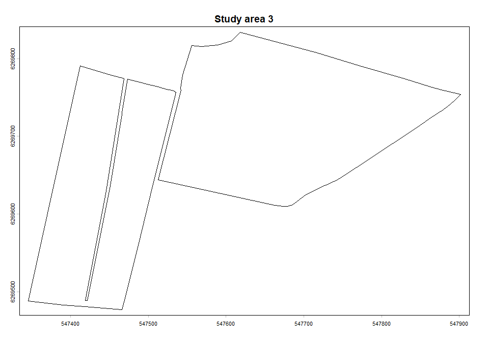
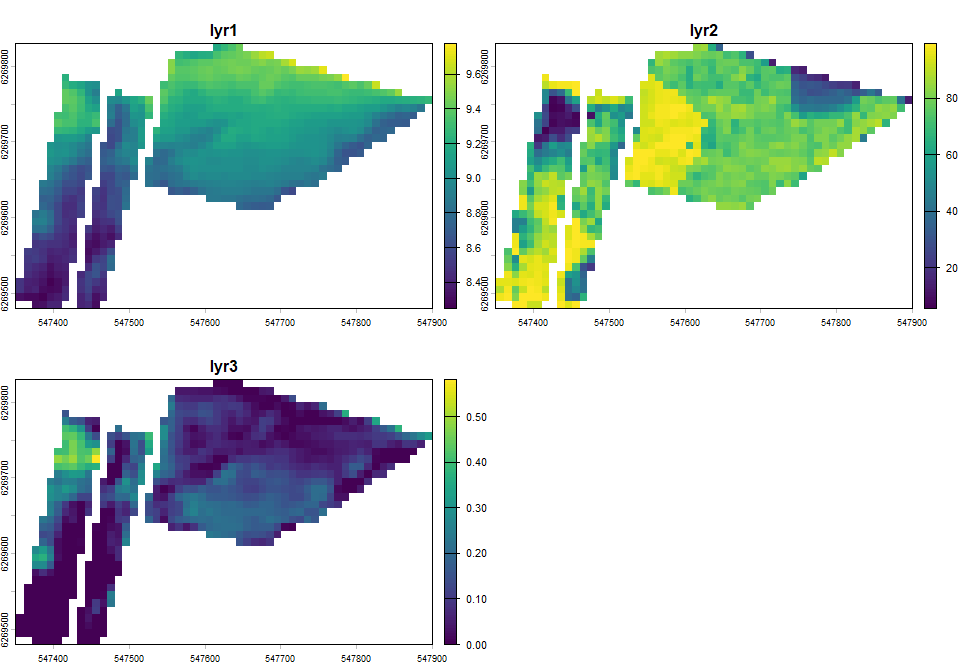
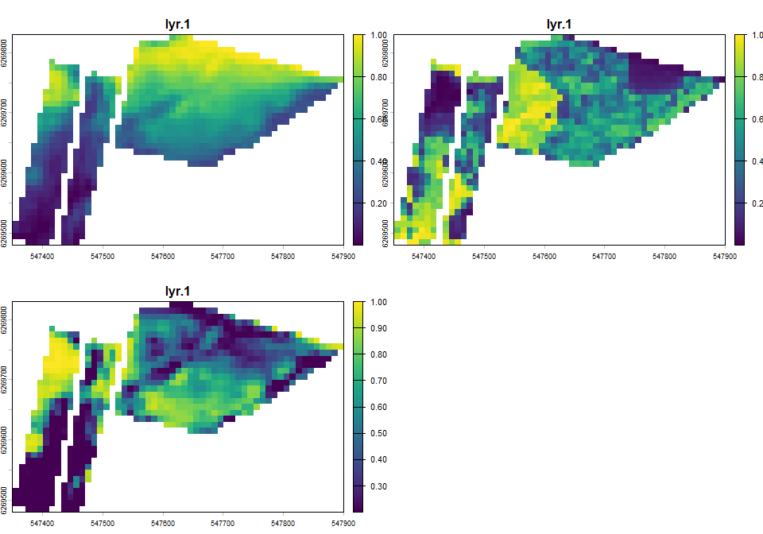
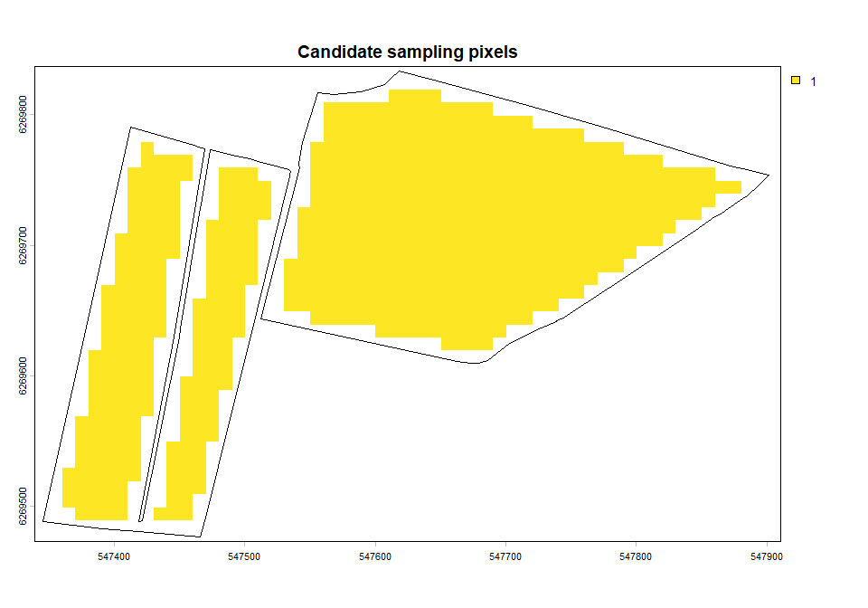
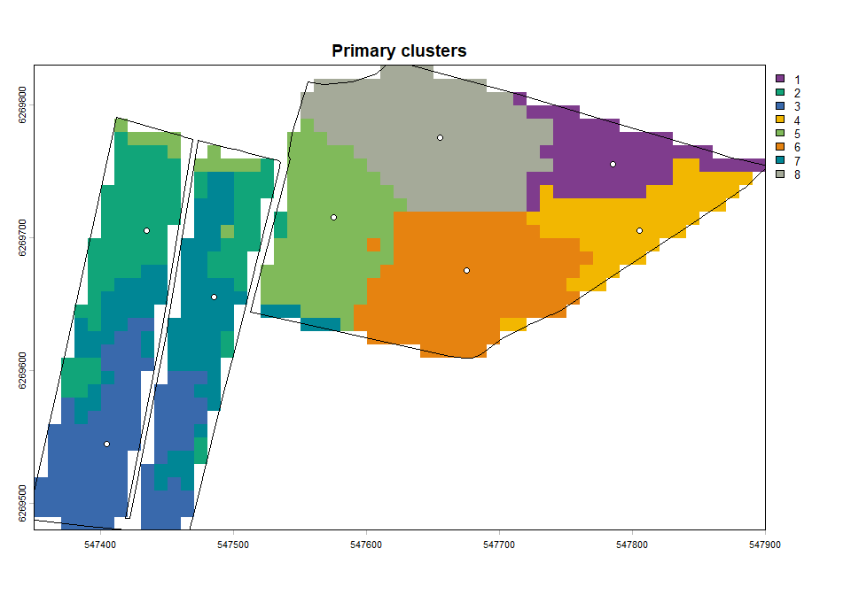
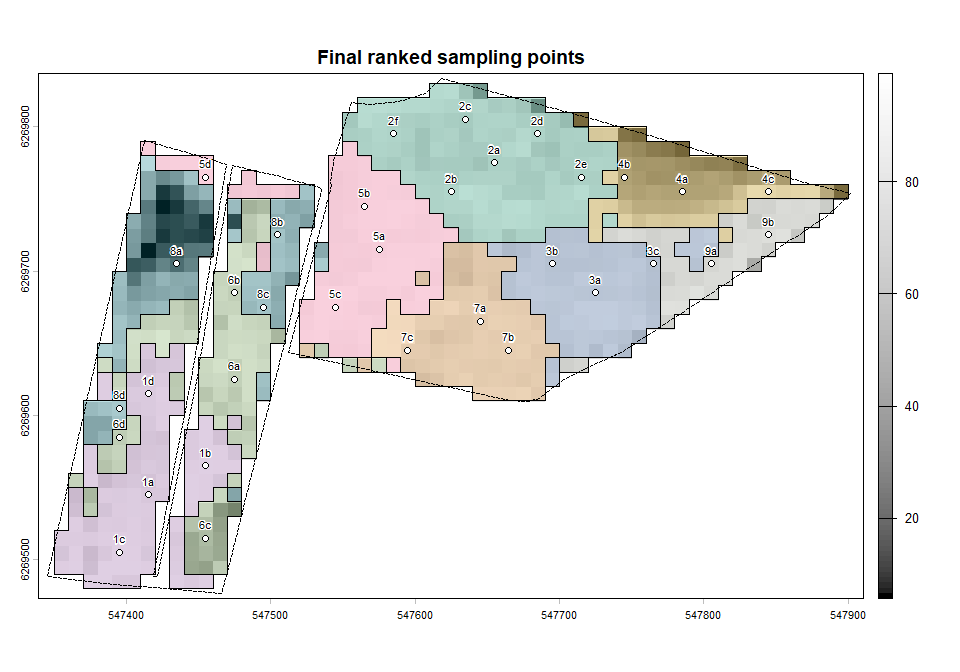

## Purpose

This document presents a workflow to generate ranked sampling points. The goal is to place one primary sampling point per cluster, add alternative sampling points within the clusters, depending on their sizes, and rank the points by distance to the cluster center.

During field sampling, one sample should be collected per cluster. The primary sampling point is the first choice, and if it is not accessible, or outside the area of interest, the alternative sampling points in the same cluster should be used. The alternative sampling points should be prioritized according to their rank, indicated by a letter suffix (e.g., 7a, 7b, 7c).

## Workflow Overview

The workflow follows these stages:

1.  Read study area and raster inputs.
2.  Crop and mask rasters to one field.
3.  Transform input layers to percentiles.
4.  Clamp outliers to reduce extreme values.
5.  Build a candidate mask for valid sample locations.
6.  Run primary k-means sampling with spatial weighting.
7.  Add extra points inside large clusters.
8.  Rank points within each cluster by center distance.
9.  Plot final labeled points.


## Parameters and Input Validation

The workflow is demonstrated for study area 3 in the UDKIK project, but it is applicable to any area within the coverage of the input rasters. In this example, the input rasters include elevation, peat probability, and the vertical distance to the channel network (vdtochn). The workflow can be adapted to other raster inputs as needed.

The parameters `sampling_zones_ha` and `sampling_points_ha` control the number of clusters and sampling locations per ha, respectively. The number of clusters is determined by the size of the study area (one cluster per ha). The number of sampling locations depends on the areas of the clusters, set to 4 sampling locations per ha in this example.


``` r
dir_data <- params$data_dir
study_area_idx <- params$study_area_idx

study_area_path <- file.path(dir_data, "Study_areas", "Study_areas.shp")
sampling_paths <- file.path(
  dir_data,
  c(
    "Sampling_input/dhm2015_terraen_10m.tif",
    "Sampling_input/peat_probability_2025_resample.tif",
    "Sampling_input/vdtochn.tif"
  )
)

sampling_input <- rast(sampling_paths)

names(sampling_input) <- basename(sampling_paths) |>
  tools::file_path_sans_ext()

sampling_zones_ha <- 1
sampling_points_ha <- 4
```


## 1. Study Area Selection

The study area covers 8.9 ha, and is divided into two agricultural fields. The variable `study_area_idx` is an integer for indexing the study area polygons.


``` r
study_areas <- vect(study_area_path)

values(study_areas)
```

```
##   Klasse_Udk Shape_Leng Shape_Area
## 1          1   2140.111  168073.24
## 2          2   2222.006  192115.35
## 3          3   2402.886   88972.91
## 4          4   2150.811   83009.21
## 5          5   1591.059   68850.74
```

``` r
plot(study_areas[study_area_idx, ], main = paste("Study area", study_area_idx))
```



## 2. Load and Subset Raster Inputs

The input rasters are cropped and masked to the selected study area. Raster cells are omitted if they contain NA values in any of the input layers.


``` r
sampling_input_field <- crop(
  sampling_input,
  study_areas[study_area_idx, ]
) |>
  mask(
    study_areas[study_area_idx, ],
    touches = FALSE
  )

sampling_input_field <- ifel(
  sum(is.na(sampling_input_field)) == 0,
  sampling_input_field,
  NA
)

names(sampling_input_field) <- names(sampling_input)

plot(sampling_input_field,
     extent = study_areas[study_area_idx, ],
  fun = function() {
    plot(study_areas[study_area_idx, ], add = TRUE)
  },
  buffer = TRUE
)
```



## 3. Percentile Transformation and Outlier Clamp

The input layers are transformed to percentiles using the empirical cumulative distribution function (ECDF). The resulting values are also clamped to three standard deviations from the mean to reduce the influence of extreme values. This is mainly relevant if any of the input layers contain many duplicate values, which can lead to large jumps in the ECDF.

The transformation into percentiles helps to make cluster sizes more uniform and counteracts the potential effects of extreme values.


``` r
sampling_input_pctile <- sapp(
  sampling_input_field,
  function(x) {
    x_ecdf <- ecdf(values(x))
    app(x, x_ecdf)
  }
)

field_means <- global(sampling_input_pctile, "mean", na.rm = TRUE) |>
  unlist()
field_sds <- global(sampling_input_pctile, "sd", na.rm = TRUE) |>
  unlist()

sampling_input_pctile <- sampling_input_pctile |>
  clamp(
    lower = field_means - field_sds * 3,
    upper = field_means + field_sds * 3
  )

names(sampling_input_pctile) <- names(sampling_input_field)

plot(
  sampling_input_pctile,
  extent = study_areas[study_area_idx, ],
  fun = function() {
    plot(study_areas[study_area_idx, ], add = TRUE)
  },
  buffer = TRUE
)
```



## 4. Candidate Sampling Pixels

The selection of sampling points is restricted to areas more than 10 m from the field boundaries. All pixels in the input are used for identifying clusters, but sampling locations are limited to the candidate pixels.


``` r
candidates_field <- ifel(
  is.na(sum(sampling_input_field)),
  NA,
  1
) |>
  mask(
    study_areas[study_area_idx, ] |>
      buffer(width = -10),
    touches = FALSE
)

plot(
  candidates_field, main = "Candidate sampling pixels",
  extent = study_areas[study_area_idx, ],
  buffer = TRUE
)
plot(study_areas[study_area_idx, ], add = TRUE)
```



## 5. Primary Cluster Sampling

The sampling zones and primary sampling locations are generated based on k-means clustering, using the package `samplekmeans`. The number of clusters is determined by the size of the study area, with one cluster per ha (rounded off).

The parameter `xy_weight` is set to 2, which means that the spatial coordinates are weighted twice as much as the input raster values. This encourages clusters to be more spatially compact, while still considering the input raster values. The `candidates` parameter ensures that only valid sampling locations are selected, and the `min_cluster_size` parameter ensures that clusters with fewer than 50 pixels (i.e. areas less than 0.5 ha) are not produced.


``` r
myclusters <- sample_kmeans(
  input = sampling_input_pctile,
  clusters = round(
    study_areas[study_area_idx, ]$Shape_Area * sampling_zones_ha / 10000
  ),
  use_xy = TRUE,
  sp_pts = TRUE,
  xy_weight = 2,
  candidates = candidates_field,
  min_cluster_size = 50,
  seed = 5082
)

plot(
  as.factor(myclusters$clusters),
  col = carto_pal(9, "Bold"),
  main = "Primary clusters",
  extent = study_areas[study_area_idx, ],
  buffer = TRUE
)
plot(myclusters$points, pch = 21, bg = "white", add = TRUE)
plot(study_areas[study_area_idx, ], add = TRUE)
```



One primary point is selected per cluster to ensure broad within-field coverage.

## 6. Add Extra Points in Large Clusters


``` r
cluster_ids <- values(myclusters$clusters, mat = FALSE)
cluster_ids <- cluster_ids[!is.na(cluster_ids)]
cluster_areas <- table(cluster_ids)

extra_pts <- list()
list_index <- 1

for (i in seq_len(nrow(myclusters$points))) {
  cid <- myclusters$points$ID[i]
  csize <- as.numeric(cluster_areas[as.character(cid)])

  if (!is.na(csize) && csize > 50) {
    rast_i <- mask(
      sampling_input_pctile,
      mask = myclusters$clusters,
      maskvalue = cid,
      inverse = TRUE
    ) |>
      trim()

    candidates_i <- mask(
      candidates_field,
      mask = myclusters$clusters,
      maskvalue = cid,
      inverse = TRUE
    ) |>
      crop(rast_i)

    distances_i <- mask(
      myclusters$distances,
      mask = myclusters$clusters,
      maskvalue = cid,
      inverse = TRUE
    ) |>
      crop(rast_i)

    clusters_i <- sample_kmeans(
      input = rast_i,
      clusters = round(csize / (100 / 3)),
      use_xy = TRUE,
      only_xy = TRUE,
      xy_weight = 2,
      sp_pts = TRUE,
      candidates = candidates_i,
      weights = sqrt(distances_i)
    )

    extra_pts[[list_index]] <- clusters_i$points |>
      mutate(cluster = cid)

    list_index <- list_index + 1
  }
}

n_extra_sets <- length(extra_pts)
n_extra_sets
```

```
## [1] 8
```

Larger clusters receive additional points, with higher preference for pixels farther from the primary center.

## 7. Rank and Label All Points


``` r
if (length(extra_pts) > 0) {
  extra_pts <- do.call(rbind, extra_pts)

  all_pts <- bind_spat_rows(
    myclusters$points,
    extra_pts
  ) |>
    mutate(
      cluster = case_when(
        is.na(cluster) ~ ID,
        .default = cluster
      )
    ) |>
    unique(atts = FALSE)
} else {
  all_pts <- myclusters$points |>
    mutate(cluster = ID)
}

all_pts <- terra::extract(
  myclusters$distances,
  all_pts,
  bind = TRUE,
  ID = FALSE
) |>
  arrange(cluster, lyr1) |>
  group_by(cluster) |>
  mutate(
    rank = rank(lyr1, ties.method = "first"),
    suffix = index_to_letters(rank),
    label = paste0(cluster, suffix)
  ) |>
  ungroup()

all_pts |>
  as.data.frame() |>
  select(cluster, rank, label, lyr1) |>
  head(15)
```

```
##    cluster rank label      lyr1
## 1        1    1    1a 0.2005391
## 2        1    2    1b 0.4371822
## 3        1    3    1c 0.9879134
## 4        2    1    2a 0.4430538
## 5        2    2    2b 1.2417856
## 6        2    3    2c 1.5929462
## 7        2    4    2d 2.1277796
## 8        3    1    3a 0.1863242
## 9        3    2    3b 0.6721634
## 10       3    3    3c 0.6913257
## 11       3    4    3d 2.5686310
## 12       4    1    4a 0.3793880
## 13       4    2    4b 1.0001651
## 14       4    3    4c 1.4629183
## 15       5    1    5a 0.2898975
```

The point closest to each cluster center is rank 1 (for example 7a), then rank 2 (7b), and so on.

## 8. Final Presentation Map


``` r
plot(
  sampling_input_field[[2]],
  col = gray.colors(100, start = 0, end = 1),
  buffer = TRUE,
  main = "Final ranked sampling points"
)
plot(
  as.polygons(myclusters$clusters),
  1,
  add = TRUE,
  alpha = 0.25,
  col = carto_pal(9, "Bold"),
  legend = FALSE,
  border = "black"
)
plot(study_areas[study_area_idx, ], add = TRUE, lty = "32")
plot(all_pts, pch = 21, bg = "white", add = TRUE)
text(
  all_pts,
  all_pts$label,
  cex = 0.7,
  col = "black",
  pos = 3,
  hc = "white",
  hw = 0.1,
  halo = TRUE
)
```



## 9. Quick Summary Metrics


``` r
summary_tbl <- all_pts |>
  as.data.frame() |>
  count(cluster, name = "n_points") |>
  arrange(cluster)

summary_tbl
```

```
##   cluster n_points
## 1       1        3
## 2       2        4
## 3       3        4
## 4       4        3
## 5       5        4
## 6       6        5
## 7       7        4
## 8       8        5
```

``` r
cat("Total points:", nrow(all_pts), "\n")
```

```
## Total points: 32
```

``` r
cat("Primary points:", nrow(myclusters$points), "\n")
```

```
## Primary points: 8
```

``` r
cat("Additional points:", nrow(all_pts) - nrow(myclusters$points), "\n")
```

```
## Additional points: 24
```

## Notes

-   This report is designed for one study area at a time using params\$study_area_idx.
-   Use the same random seed to keep results reproducible.
-   If data paths change across machines, only params\$data_dir needs to be updated.
